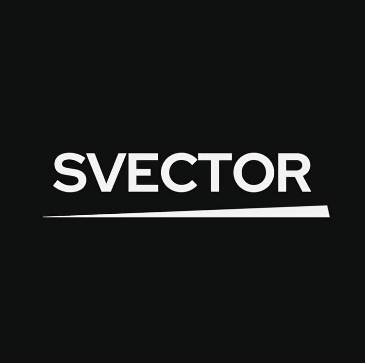

<h1>SVECTOR 🚀</h1>
 
</img>
 
SVECTOR
 
SVECTOR-CORPORATION is a cutting-edge software development company specialized in Artificial Intelligence (AI), Machine Learning (ML), and a wide range of software solutions. We are dedicated to pushing the boundaries of technology and delivering innovative products that transform industries.

## Our Services 🌟

- **AI & ML Applications** 🤖: We develop intelligent systems powered by advanced algorithms and machine learning models, enabling data-driven decision-making and automation.
- **Software Development** 💻: Our team of skilled developers crafts custom software solutions tailored to your unique business needs, ensuring seamless integration and optimal performance.
- **Web & Mobile Applications** 📱: We create responsive and user-friendly web and mobile applications, leveraging the latest technologies to deliver exceptional digital experiences.
- **Cloud Solutions** ☁️: We harness the power of cloud computing to provide scalable, secure, and cost-effective solutions for businesses of all sizes.
- **Data Analytics & Visualization** 📊: Our data experts help you unlock the potential of your data, transforming it into actionable insights through advanced analytics and compelling visualizations.
- **Cybersecurity Solutions** 🔒: We prioritize data protection and implement robust cybersecurity measures to safeguard your digital assets against evolving threats.

## Our Expertise 💪

At SVECTOR-CORPORATION, we pride ourselves on our diverse expertise and deep knowledge across a wide range of technologies and programming languages, including:

- Python, Java, C++, C#, JavaScript, TypeScript, Go, Ruby, Swift, and more
- React, Angular, Vue.js, Node.js, Django, Flask, Spring, .NET Core
- TensorFlow, PyTorch, Scikit-learn, Keras, OpenCV, NLTK
- AWS, Google Cloud, Microsoft Azure, Docker, Kubernetes
- MySQL, PostgreSQL, MongoDB, Redis, Elasticsearch, Apache Kafka

## Join Our Team 🚀

We are always on the lookout for talented and passionate individuals to join our dynamic team. If you are a skilled developer, data scientist, or tech enthusiast, visit our [Careers page](https://svector-corporation.com/careers) to explore exciting opportunities.

## Contact Us 📞

For more information about our services or to discuss your project requirements, please don't hesitate to reach out:

📧 Email: contact@svector-corporation.com
🌐 Website: https://svector-corporation.com
📱 Phone: +1 (123) 456-7890

Let's embark on a journey of innovation together! 🌍✨
